> **⚠️ 注意：此仓库为第三方修改版（Mod），非原项目官方版本。**
> 
> 原项目：[simple_sq_music_plus](https://github.com/59799517/simple_sq_music_plus) by [@59799517](https://github.com/59799517)  
> 本仓库在原项目基础上进行了功能修改，仅供个人学习与使用。所有原始代码版权归原作者所有。
> 如有侵权问题，请联系我删除。

---

## simple_sq_music_plus_mod（Mod 版本）

### 相对原版的改动

- **修复 ALBUM_ARTIST 标签**：专辑艺术家标签现在使用专辑的主艺术家，而非单曲艺术家，确保 Navidrome/Jellyfin 等服务正确归集专辑
- **支持曲目编号（Track Number）写入**：下载整张专辑时自动写入曲目序号到文件 tag
- **简化 CI/CD 流程**：GitHub Actions 工作流重构为单 Job 多架构构建（amd64 + arm64）

### 使用 ghcr.io 镜像快速部署（推荐）

镜像由 GitHub Actions 自动构建并发布，支持 `linux/amd64` 和 `linux/arm64`，Docker 会自动选择匹配当前服务器的版本。

```bash
# 下载部署文件
curl -O https://raw.githubusercontent.com/kennysoul/simple_sq_music_plus_mod/3.0/docker-compose-ghcr.yml

# 启动（首次运行如报错请等待 MySQL 初始化完成后重试）
docker compose -f docker-compose-ghcr.yml up -d
```

- 默认 Web 端口：`8096`
- 默认账号/密码：`admin` / `admin`
- 音乐文件目录：当前目录下的 `./music`（可在 `docker-compose-ghcr.yml` 中修改）

> 如需使用原版官方镜像，请参考下方原版说明。

---

## 原版说明

最新NAS坏了 等修好了再更新版本

### 出现问题先升级到最新版本
### simple_sq_music_plus
是下载音乐工具，可以当普通的音乐下载工具使用，支持，flac，ape，mp3等格式的下载（根据码率不同）， 下载的歌曲目录结构支持emby 与 subsonic（后续开放） 类的服务，下载文件支持文件标签识别，歌词下载。
```js
\Music下载根路径
       \歌手名称
               \专辑名称
                       1- 歌曲1.flac
                       2- 歌曲2.flac

```
默认支持群辉等第三方音乐服务标识：
emby,jellyfin识别请参考如下配置 https://support.emby.media/support/solutions/articles/44001159113-music-naming

- 默认账号：admin
- 默认密码：admin  （登录后设置自行修改）


效果截图
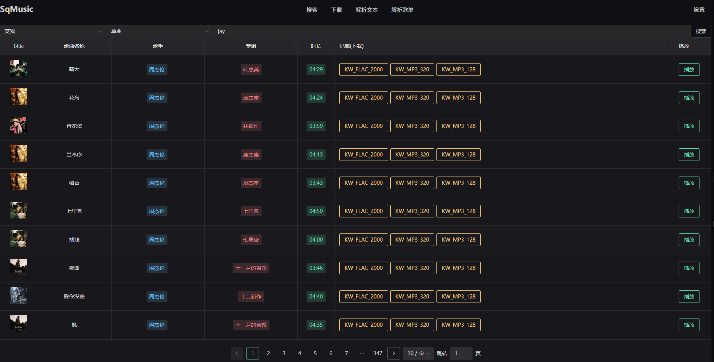
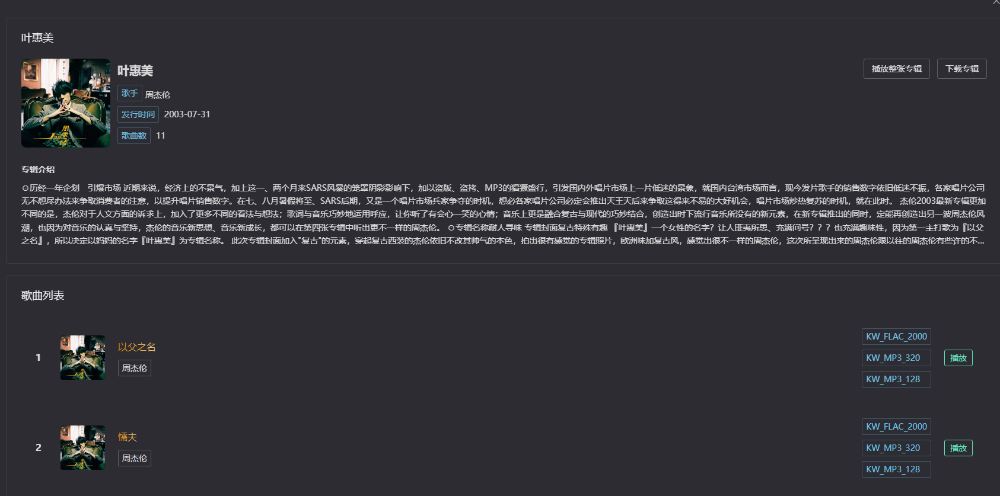
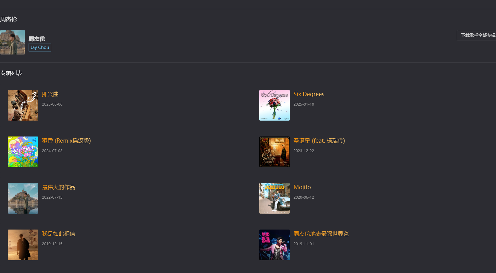
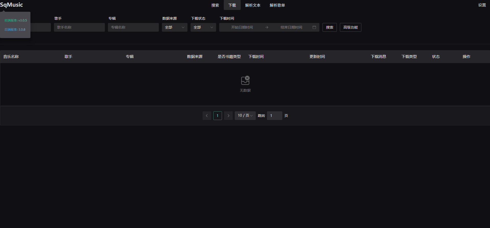
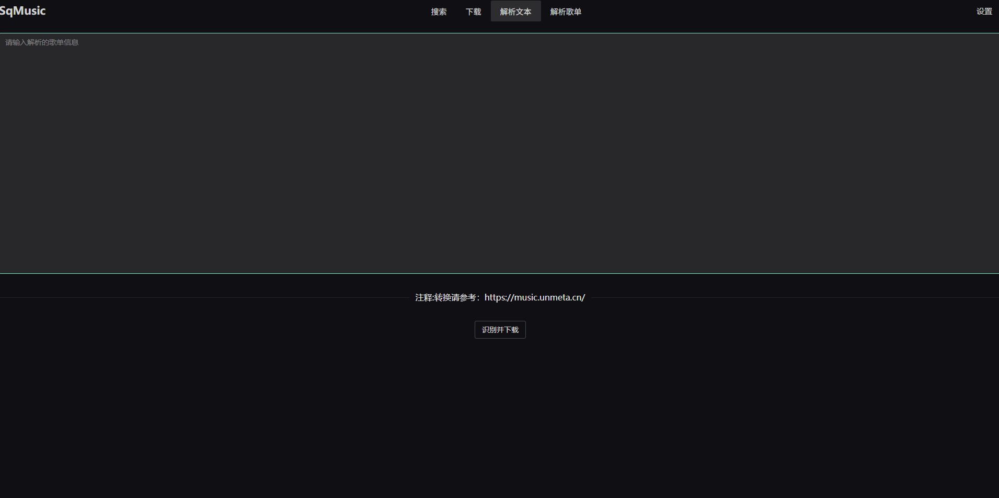
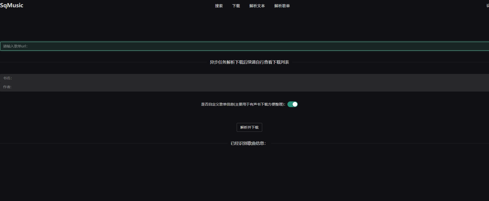
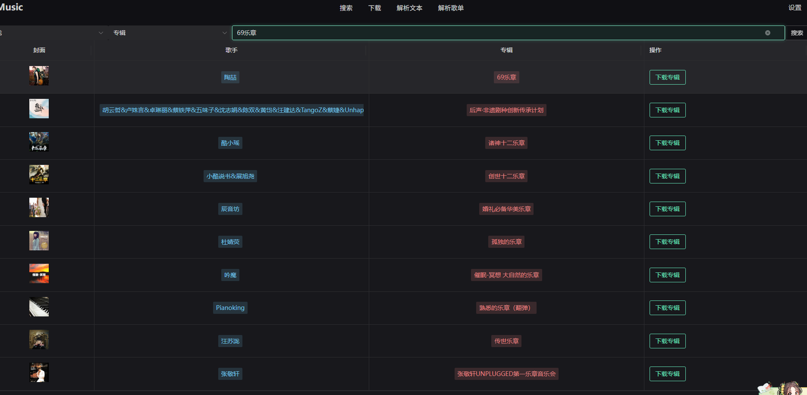
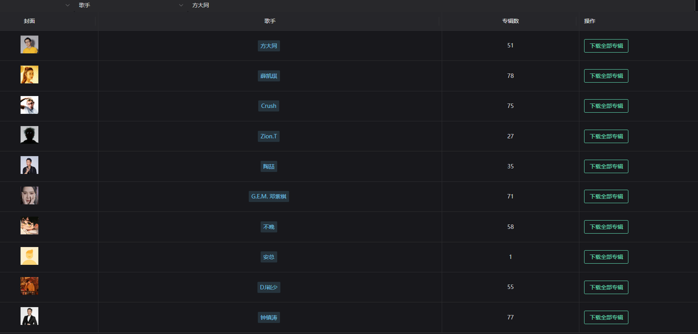
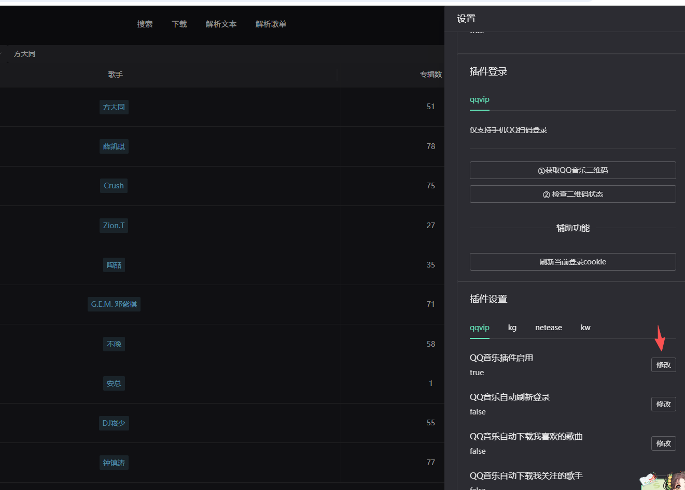
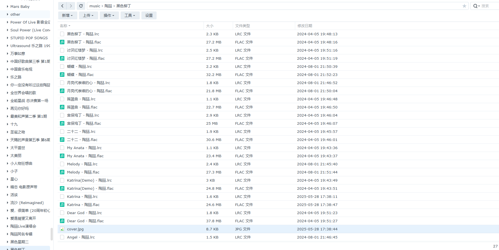
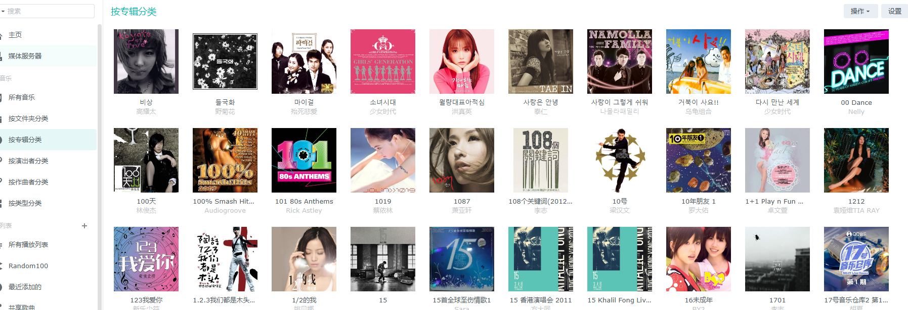


### 2.x迁移3.x版本
1. 导出已经同步过的歌单、专辑、歌手信息（文件是.json）
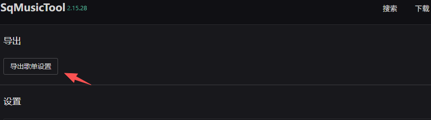
2. 3.0版本导入已经同步信息(时间较长耐心等待)
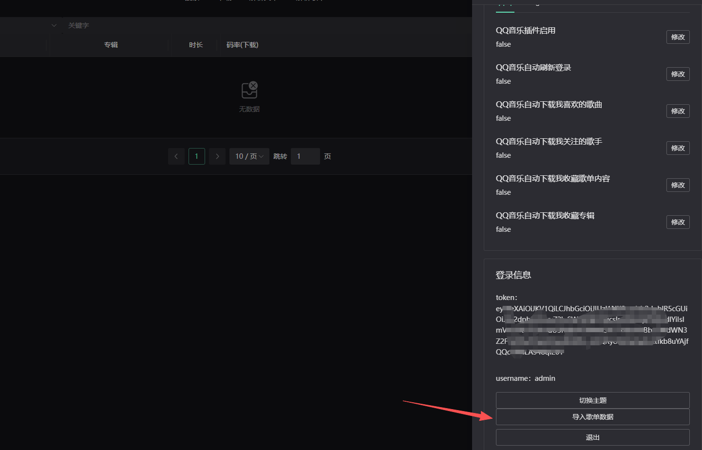

### 运行项目
#### 1. docker-compose（推荐--mysql启动慢导致报错可以多运行几次）
    运行docker-compose文件即可（本地编译使用docker-compose-local）
#### 2.docker启动请参考docker-compose配置手动启动
1. 启动mysql
```dockerfile
# 拉取 MySQL 5.7 镜像
docker pull mysql:5.7

# 创建自定义网络
docker network create sq-app-network

# 运行 MySQL 容器
docker run -d \
  --name sqmusic_mysql \
  --restart=always \
  -e MYSQL_ROOT_PASSWORD=sqmusicv3password \
  -e MYSQL_DATABASE=sqmusicv3 \
  -v ./mysql_data:/var/lib/mysql \
  -p 3306:3306 \
  --network simple_sq_music_plus_sq-app-network \
  mysql:5.8
```
2. 启动后端服务
```dockerfile
# 拉取后端服务镜像（使用最新版本号）
docker pull registry.cn-hangzhou.aliyuncs.com/sqdockler/simple_sq_music_plus:v3.0.8

# 运行后端容器
docker run -d \
  --name sqmusic_main \
  --restart=always \
  -e DB_IP=mysql \
  -e DB_PORT=3306 \
  -e DB_NAME=sqmusicv3 \
  -e DB_USERNAME=root \
  -e DB_PASSWORD=sqmusicv3password \
  -v ./music:/music \
  --network simple_sq_music_plus_sq-app-network \
  registry.cn-hangzhou.aliyuncs.com/sqdockler/simple_sq_music_plus:latest
```
3. 启动前段服务
```dockerfile
# 拉取前端服务镜像（使用最新版本号）
docker pull registry.cn-hangzhou.aliyuncs.com/sqdockler/simple_sq_music_plus_web:v3.0.5

# 运行前端容器
docker run -d \
  --name sqmusic_web \
  --restart=always \
  -p 8996:80 \
  --network simple_sq_music_plus_sq-app-network \
  registry.cn-hangzhou.aliyuncs.com/sqdockler/simple_sq_music_plus_web:latest

```

Todo：
1. 页面增加播放页面播放删除
2. 支持苹果音乐
3. ~~增加网易云监听歌单~~
4. ~~增加指定格式下载~~
5. ~~增加当前下载速度展示~~
6. 增加下载暂停功能
7. ~~手机模式下专辑和歌手不展示问题~~

#### 3.0后续升级脚本可以使用scrpit下的 check_update.sh脚本


